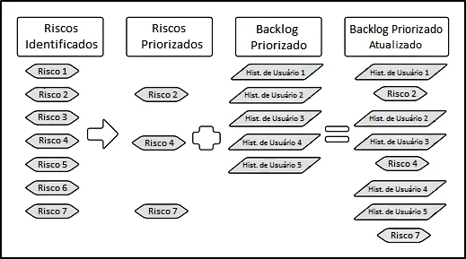
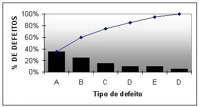
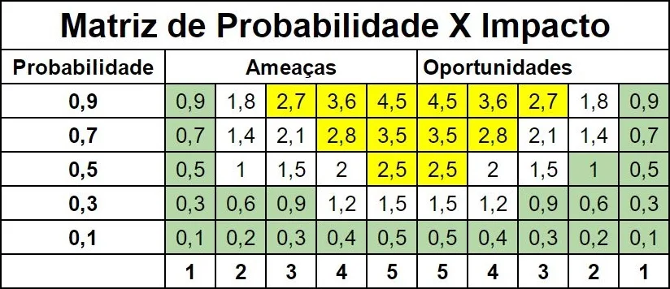

# Riscos no Scrum

 

O **Risco**  é um evento incerto, porém quantificável. O Risco pode afetar os objetivos de um projeto e também contribuir para seu sucesso ou fracasso. O Risco pode ser assumido como algo positivo ou negativo, mas ele não deve ser considerado um problema, já que o problema é uma situação com certezas bem definidas, que estão acontecendo atualmente no projeto.

 

 

- O primeiro passo é **identificar os Riscos** e analisar numericamente as chances de eles ocorrerem;
- Assim, poderemos **priorizar os Riscos** e buscar resolver os que podem causar maior impacto negativo;
- Selecionados os Riscos a serem trabalhados eles serão somados às informações do ***Backlog* Priorizado**;
- O resultado deste esquema será o ***Backlog* Priorizado Atualizado** que mescla Riscos com tarefas. Neste caso os riscos serão ou mitigados ou eliminados nos casos de ameaça.

> Priorize Riscos da mesma forma como você prioriza as Histórias de Usuário

### Atitude de Risco

Esta item está relacionado com a forma com que a organização lida com a possibilidade de Riscos afetarem o projeto. A forma de trabalhar os riscos pode ser:

- Apetite de Riscos: buscam-se riscos e se "aposta alto";
- Tolerância aos Riscos: conhecimento prévio para a definição do limite de riscos aceito pela organização. Isto é, "até que ponto" a empresa lida bem com os riscos?;
- Limite de Riscos: é o ponto máximo que pode ser alcançado ao lidar com riscos, por exemplo um limite financeiro "um risco negativo de no máximo R$1000 é o que a empresa pode suportar nesse projeto".
- O Time Scrum deve identificar todos os Riscos que podem afetar o projeto.

Existem algumas interpretações diferentes, dependendo da organização, sobre Riscos: 

(1) **Avessas ao Risco**; 

(2) **Neutras ao Risco**;

(3) Aquelas que **Buscam o Risco**;

 

## Riscos Scrum

 trabalharemos com técnicas para identificar os riscos de maneira a controlá-los evitando maiores perdas. Abaixo são elencadas algumas atitudes para alcançar esses objetivos:

- Rever as lições aprendidas e buscar nos projetos anteriores os fatores problemáticos que podem ocorrer nos próximos projetos;
- *Checklist* de Riscos;
- *Brainstorm*: reunir o grupo que está trabalhando no projeto para que juntos identifiquem os Riscos;
- Estrutura Analítica de Risco: utilizar o diagrama para categorizar os Riscos, pois, existem diferentes tipos de Riscos: os Riscos Técnicos, Internos e Externos.

### *Risk-Based Spike*

O *Risk-Based Spike* é um **protótipo** que auxilia no entendimento dos riscos potenciais. O método instiga o Risco a ocorrer, assim, seu verdadeiro impacto pode ser analisado em ambiente controlado, sem que cause muitos danos. Também é um **exercício intenso** para ajudar o time a determinar as incertezas presentes no projeto. 

### Avaliação de Risco

Neste ponto temos que levar em conta o **Impacto Potencial** e a **Probabilidade de Ocorrência**. Por exemplo, um impacto financeiro potencial de R$1000,00 (mil reais) cuja probabilidade de ocorrer é de 50%. Esses fatores são determinantes para que se identifique e se controlem os riscos de um projeto. 

### Técnicas de Avaliação de Risco

- Reunião de Risco: os riscos podem ser mais facilmente **priorizados** em uma reunião com o **Time Central do Scrum**, avaliar em equipe quais riscos deverão ser trabalhados em primeiro lugar e quais não demandam urgência;

- Árvore de Probabilidade: com o "risco" centralizado, é partindo dele que desenhamos as respostas possíveis e, assim, podemos compará-las na hora de tomar a decisão sobre qual resposta escolher;

- Análise de Pareto: a análise inclui o gráfico apresentado abaixo, no qual podemos analisar o tipo de risco e a chance de ocorrência:

 

 

- Tabela de Probabilidade e Impacto: é outras das técnicas de avaliação de risco. Observe-a logo abaixo;

 

 

- O cálculo do Valor Monetário Esperado (VME):  A fórmula empregada é **VME = Probabilidade de Ocorrência X Impacto de Risco*. Vamos utilizar os valores de referência usados no exemplo anterior: 0,5 x 1.000 R$ = 500.

###Mitigação de Risco

O risco pode ser **mitigado** por meio da implementação de uma série de **respostas**, na maioria dos casos as respostas são **proativas ou reativas**; das quais o primeiro grupo de medidas são discutidas e elaboradas antes da ocorrência do incidente, enquanto o segundo são as respostas elaboradas após o incidente. 

###Comunicação de Risco

As informações relacionadas ao risco devem incluir o **impacto potencial** e os planos de **resposta** para cada risco, para que qualquer um que vá lidar com os riscos saiba o potencial deles e como dar uma resposta.

###Minimizando Riscos em Scrum

A estrutura funcional do Scrum foi elaborada também para lidar facilmente com os riscos. Abaixo estão descritas algumas características do *framework* e como elas nos auxiliam a enfrentar essas dificuldades.

- A **flexibilidade** em Scrum, devido ao uso dos **Sprints**, reduz a chance e o alcance dos Riscos ;
- A iteratividade e o **feedback regular** reduzem a expectativa de riscos;
- A atualização contínua do *Backlog* do Sprint é uma **estimativa mais precisa**;
- A **transparência** em Scrum permite que a identificação dos riscos ocorra mais facilmente;
- A **entrega iterativa** reduz os riscos de investimentos.

 

## [Exercício] Risco em um Projeto Scrum

Às vezes, um projeto Scrum vai ter riscos. Sobre riscos em um projeto Scrum, é correto afirmar:

- [x] A) É um evento incerto que pode afetar os objetivos de um projeto.
- [ ] B) É um evento esperado que não pode afetar os objetivos de um projeto
- [ ] C) Não influencia no sucesso ou fracasso do projeto.
- [ ] D) É uma certeza bem definida, que está acontecendo atualmente no projeto.

Risco é um evento incerto que pode afetar os objetivos de um projeto e que pode contribuir para o seu sucesso ou fracasso do projeto. Ele pode ser positivo ou negativo, uma ameaça ou oportunidade.

 

## [Exercício] Atitudes de Risco

Riscos são comuns, mas devem ser tratados com cuidado. São consideradas atitudes de Risco, exceto:

- [ ] A) Tolerância aos Riscos
- [ ] B) Avesso aos Riscos
- [ ] C) Apetite de Riscos
- [x] D) Identificação de Riscos

São atitudes de risco: Apetite a Risco, Tolerância a Risco, Limite de Risco, Avesso a Risco, Risco Neutro, Buscando o Risco.

 

## [Exercício] Identificar os Riscos

Os riscos devem ser identificados no projeto. Em um projeto Scrum, quem é responsável por identificar os Riscos durante todo o projeto:

- [x] A) Todos os membros do Time Scrum
- [ ] B) Time de Desenvolvimento
- [ ] C) Dono do Produto
- [ ] D) Scrum Master

Os membros do Time Scrum devem tentar identificar todos os riscos que possam afetar o projeto. Este trabalho apenas pode ser realizado por completo, quando os membros do time passam a olhar para o projeto, a partir de perspectivas diferentes, e a utilizar várias técnicas.