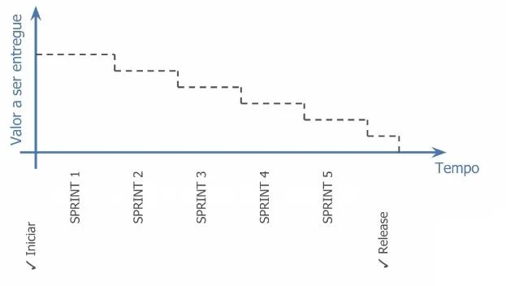

# Implementação e Gerenciamento de Mudanças

 

## Iterativo incremental

 vamos entender como funciona e como devemos fazer a **Implementação e o gerenciamento de mudanças em Scrum**.

 

### Público-alvo

- Gerentes de Projeto;

- Desenvolvedores;

- Analistas de requisitos;

- Estudantes.

 

### Conteúdo Programático

- **Desenvolvimento Iterativo**:  Como entregar resultados por meio do Gerenciamento Ágil de Projetos, como funciona a relação com o Cliente e o que é uma Iteração;

- **Implementação**: Vamos aprender a aplicar, dentro de uma organização, as metodologias e *frameworks* estudados;

- **Responsabilidades na Implementação**: Qual é o papel de cada integrante do Time Scrum na hora de aplicar os processos estudados?;

- **Gerenciamento das Mudanças em um Projeto Scrum**:  Vamos ver quais são os benefícios e qual é a lógica que devemos utilizar para determinar o número de semanas em um *sprint*, como pensar os problemas e como buscar formas de entender a mudança no contexto ágil de Gerenciamento de Projetos.

 

## Desenvolvimento Iterativo

O desenvolvimento iterativo permite a **correção de curso** na medida que o Time Scrum adquire um **melhor entendimento**. A **iteração** não deve ser confundida com **interação**, embora ela pressuponha interatividade, é mais do que isso, ela é a interatividade em momentos específicos.

Por exemplo, se formos fazer uma iteração com um cliente ela pode ter a duração de 1 mês. Vamos considerar o intervalo entre dois encontros. Vamos fazer contato com o cliente no primeiro dia do mês e no último dia, no primeiro contato, vamos buscar entender o que o cliente precisa e no segundo vamos ver se conseguimos alcançar aquilo que foi requisitado.

Diferente da gestão tradicional de projetos, onde as iterações são mais demoradas e as vezes se resumem a uma reunião no início do projeto e uma no fim, podendo levar até um ano sem contato entre os desenvolvedores e o cliente. No Scrum, nós buscamos manter as iterações mais curtas, para garantir que o projeto está seguindo a vontade do cliente e entregar aquilo que ele realmente está buscando. Portanto, são feitas reuniões a cada 2 ou 4 semanas, dependendo do projeto.

Dessa forma conseguimos entregar mais valor, mais rapidamente. Buscando o que é mais urgente e o que é de maior valor para o cliente, é possível entregar mudanças mais concretas no começo. Então, vamos começar a aperfeiçoar o produto, como podemos ver na imagem abaixo:

 

 

Analisando a imagem, podemos ver uma diminuição no valor entregue ao longo do tempo de projeto, isto não deve ser visto como algo ruim. A grande vantagem de trabalhar com uma visão ágil é justamente entregar a maior mudança, por exemplo, o que é mais urgente e necessário para o cliente logo no começo ou o mais rápido possível. Então, quanto mais avançamos no projeto, menos urgências precisamos entregar, tornando mais rápida, assim, a entrega final.

O grande objetivo do Scrum é desenvolver porções funcionais do produto à cada entrega, ou seja, a cada *sprint* o projeto é aperfeiçoado e uma parte que efetivamente faz diferença é entregue. Assim podemos classificar o processo de Iteração no Scrum como **Incremental**.

### Em cada Sprint se repetem as fases: 

- Planejar e Estimar;

- Implementar;

- Revisão e Retrospectiva;

### Priorização Baseada em Valor

A priorização baseada em valor tem o papel de oferecer o **máximo valor** de negócio em um **período de tempo mínimo**. A priorização deve ser feita mantendo em mente alguns conceitos importantes:

- Valor;
- Risco;
- Dependência

### Cronograma da Release

É uma visão geral de tudo que tem que ser feito no projeto, quebrado em *sprints*. Ou seja, a cada *sprint ou conjunto de *sprints* vamos realizar uma entrega. E o Dono do Produto quando faz este Cronograma da Release do Projeto, deve considerar as dependências e os riscos de entregar antecipadamente uma funcionalidade sem ter todos os serviços complementares concluídos.

 

## [Exercício] Máximo Valor de Negócio

Para que o cliente tenha os benefícios antes, oferecer o máximo valor de negócio em um período mínimo de tempo, é a definição de:

- [ ] A) Valor Agregado
- [ ] B) Priorização do Backlog do Produto
- [x] C) Priorização Baseada em Valor
- [ ] D) Justificativa de Negócio

Oferecer o máximo valor de negócio em um período mínimo de tempo, é a exata definição de Priorização Baseada em Valor.

 

## [Exercício] Correção do Curso

A proposta do scrum é entregar porções funcionais a cada iteração. Permitir a correção do curso, na medida em que o Time Scrum adquire um melhor entendimento, é um benefício de:

- [x] A) Desenvolvimento Iterativo
- [ ] B) Melhoria contínua
- [ ] C) Time-box 
- [ ] D) Gerenciamento de Mudanças

O maior benefício do desenvolvimento Iterativo em Scrum é permitir a correção do curso, na medida em que o Time Scrum adquire um melhor entendimento.