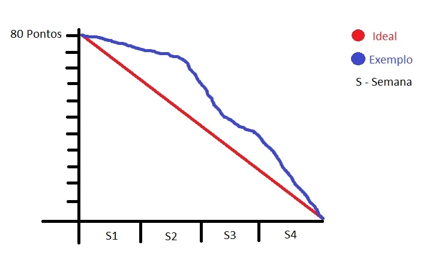

# Criando Entregas

 

O Time Scrum trabalha nas **tarefas** no *Backlog* da *Sprint* para **criar as entregas** da *Sprint*. Devido a utilização do método **iterativo incremental** as entregas são divididas e o projeto é composto "parte a parte", sendo cada parte entregue (chamadas de **entregáveis da *Sprint***) no final de cada conjunto de *Sprints*.

Ao longo do trabalho de construção desses produtos, nós utilizaremos a ferramenta chamada ***Scrumboard***, ela facilita a visualização do andamento das tarefas e portanto deve ser atualizada constantemente e recriada do zero a partir do planejamento de cada nova *Sprint*.

| História | A Fazer | Em Progresso | Em Testes | Pronto |
|----------|---------|--------------|-----------|--------|
|     1    |         |              |           |        |
|     2    |         |              |           |        |
|     3    |         |              |           |        |
|     4    |         |              |           |        |

Esse é um exemplo de ***Scrumboard*** que pode ser feito com as ferramentas *Scrumhalf*,  *Target Process*, ou também com *Post It* na parede da sala da empresa. Para elaborarmos o quadro devemos posicionar durante o início da *Sprint* todas as tarefas sugeridas durante o planejamento na primeira coluna **A Fazer**, conforme o projeto anda e as tarefas vão sendo feitas elas passam para as outras colunas **Em Progresso**, **Em Testes** e **Pronto**.

### Como Integrar Riscos ao Planejamento Scrum?

Enquanto estivermos gerindo o *backlog* nós estaremos analisando e gerindo também os Riscos, o Dono do Produto deverá integrar esses Riscos ao próprio *backlog* do produto, assim, esses Riscos contarão como atividades adicionais no *backlog* e poderão ser consultados e analisados dentro do planejamento Scrum.

### Riscos Identificados

Durante a criação dos entregáveis, novos riscos podem ser identificados e assim, adicionados ao *backlog* para que eles sejam trabalhados. Em casos mais complicados o Dono do Produto poderá tomar a decisão de cancelar o Sprint em questão, seja devido a identificação de um grande número de novos pequenos Riscos ou de poucos Riscos, mas que possam acarretar grande perdas.

### Atualização das Dependências

É importante que essas atividades tenham suas dependências atualizadas, porque novas relações entre as tarefas podem surgir ao criar os entregáveis. O time de desenvolvimento tem autoridade para modificar as dependências e, assim, alterar sua forma de trabalho quando achar necessário.

 

## Ferramentas para Criar Entregas

Falaremos sobre algumas ferramentas necessárias para criar as Entregas durante o desenvolvimento do projeto em Scrum.

- **Conhecimento do Time Scrum** é a principal ferramente para criar a entrega, pois, por ser um time formado por especialistas, que também conhecem outras áreas a experiência coletiva do Time Scrum em entender as tarefas e o projeto como um todo irá nos ajudar a avaliar e decidir quais pontos deverão ser entregas ao final de uma *Sprint*;

- ***Softwares*** além do conhecimento, do "saber lidar" a equipe irá precisar de meios para criar a entrega, os *softwares* são exemplos de ferramentas que podem ser utilizadas para agendamento, coleta de informações e distribuição. Contudo deverão ser consideradas todas as ferramentas necessárias para o trabalho, não apenas ferramentas digitais ou com alguma característica específica.

- A **Experiência do Scrum *Guidance Body*** é o que auxilia a equipe a fazer as entregas e a fundir as regras do **Scrum** com o "espírito" da empresa, já que o guia do Scrum é generalizado e não leva em conta a especificidade de cada empresa cabe ao grupo Scrum *Guidance Body* fazer essas adaptações, quando necessárias.

 

## Reunião Diária

Daremos foco para a **Reunião Diária** prevista no guia Scrum. Ela é uma ferramenta essencial para qualquer projeto em Scrum, abaixo são citadas algumas das características específicas desse tipo de reunião.

- Ferramenta do Ciclo de Desenvolvimento de uma *Sprint*;

- **Time-box** - duração de no máximo 15 minutos e não pode ultrapassar o tempo estipulado;

- Todos os membros do Time Scrum devem estar presentes;

- Scrum Master deve ser o facilitador da reunião.

### Benefícios:

Ao manter o contato diário entre os integrantes da equipe a prática da reunião diária traz vários benefícios para o projeto e para a equipe, tais como:

- Time Scrum motivado;

- Novos riscos identificados;

- Riscos são mitigados;

### Atualizações:

- *Scrumboard*;

- Gráfico *Burndown*.

#Técnicas para Conduzir uma Reunião Diária

Agora que já entendemos as características gerais da reunião diária e sua importância, nós apresentaremos algumas ferramentas de execução que ajudarão a entender como colocar as reuniões diárias em prática, e também, falaremos sobre técnicas para a condução dessas reuniões.

### Técnica das 3 perguntas

Nessas reuniões três perguntas são fundamentais! Ao serem respondidas por todos os membros da equipe de desenvolvimento, fazemos com que eles revisem o trabalho que vem sendo feito e ao mesmo tempo compartilhem suas dificuldades com o restante da equipe.

- O que eu fiz ontem?

- O que eu farei hoje?

- Quais obstáculos estou enfrentando?

### Sala de Guerra

É a denominação dada ao ambiente no qual os membros do time podem comunicar-se com liberdade, sem o peso da formalidade. Dessa forma, os membros do time podem entender melhor as ideias e sentimentos de outros membros e, assim, todos poderão trabalhar de forma conjunta, sabendo das dificuldades dos colegas fica fácil auxiliá-los e ajudar a superá-las.

### Vídeo conferência

Por mais que esses encontros sejam de extrema importância, pode acontecer do Time Scrum não estar presente no mesmo local de trabalho ao mesmo tempo, aí entram as ferramentas tecnológicas como as vídeo conferências que permitem que a reunião aconteça.

 

## Backlog Priorizado do Produto

Quaisquer **mudanças ou atualizações** no backlog devem ser discutidas e incorporadas no **Backlog Priorizado do Produto**. Por exemplo, se uma *Sprint* foi terminada, mas uma entrega não foi aceita, ela vai retornar para o Backlog do Produto e, posteriormente, se o dono do produto achar importante, ele vai entrar na próxima *Sprint*.

O **Backlog Priorizado do Produto** pode ser atualizado pelas seguintes situações:
 - Novas Histórias de Usuários;
 - Novas Solicitações de Mudança;
 - Novos Riscos Identificados;
 - Histórias de Usuários atualizadas.

O **Cronograma** de Planejamento da *Release* pode ser **atualizado** para refletir o impacto do refinamento.

### Técnica para Refinar o Backlog Priorizado do Produto

A técnica utilizada para refinar o Backlog é realizar uma **reunião de Revisão do Backlog Priorizado do Produto**. Essa estratégia assegura que as **Histórias de Usuários** e os **Critérios de Aceitação** sejam compreendidos e alinhados com as prioridades reais dos clientes.

 

## Gráfico Burndown

O Gráfico Burndown é uma ferramenta simples e nele relacionamos o ideal com o desempenho real da equipe. Em um dos eixos do gráfico são colocados os pontos que devem ser entregues na *Sprint*, isto é, aquilo que deve estar pronto em um prazo pré-determinado. No gráfico o objetivo é zerar os pontos e alcançamos isso quando as tarefas delimitadas são concluídas. Portanto, considerando as semanas, temos um "ideal". 

O exemplo abaixo mostra que a equipe enfrentou problemas nas entregas durante as primeiras duas semanas, mas um avanço grande ocorreu a partir da terceira semana. Mesmo fazendo um caminho diferente, a equipe também chegou ao ponto zero, do "ideal".

 

 

## [Exercício] Reuniões Diárias

Todos os membros do time scrum devem estar presentes nas reuniões diárias, que são time-box scrum e devem ter a duração máxima de:

- [ ] A) 1 hora
- [ ] B) 30 minutos
- [ ] C) 45 minutos
- [x] D) 15 minutos

O Time-box Scrum indica que as Reuniões Diárias devem ter o tempo máximo de 15 minutos. Contudo, se o Dono do Produto não estiver presente, não há problema.

 

## [Exercício] Condução da Reunião Diária

A reunião diária pode trazer muitos benefícios. Durante a condução da Reunião Diária é indicado o uso da técnica das 3 perguntas listadas abaixo, exceto:

- [ ] A) O que farei hoje?
- [ ] B) O que eu fiz ontem?
- [x] C) Quais critérios para a priorização do Backlog do Produto?
- [ ] D) Quais obstáculos estou enfrentando?

A técnica de 3 perguntas na Reunião Diária referem-se a: O que eu fiz ontem? O que farei hoje? Quais obstáculos estou enfrentando?

 

## [Exercício] Atualização no Backlog

Estamos evoluindo bastante na matéria! Qualquer mudança ou atualização do backlog deve ser discutida. São geradores de atualização no Backlog Priorizado do Produto, exceto:

- [x] A) Mudanças rejeitadas
- [ ] B) Histórias de Usuários atualizadas
- [ ] C) Novos Riscos Identificados
- [ ] D) Novas Solicitações de Mudanças aprovadas

Mudanças rejeitadas não influenciam no do Backlog do Produto. Enquanto que novos riscos identificados, novas solicitações de mudanças aprovadas e Histórias de usuário novas ou atualizadas, são geradores de atualização no Backlog Priorizado do Produto.