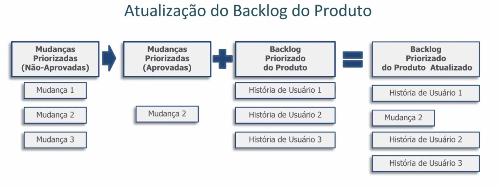
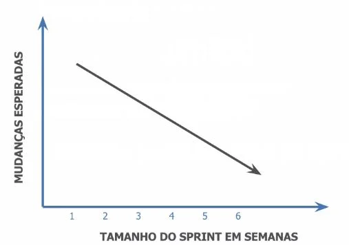

# Gerenciamento de Mudanças com Agile

 

## Gerenciamento das Mudanças em Scrum

O **Time Scrum deve compreender que** processos de desenvolvimento Scrum são projetados para **aceitarem mudanças** sem que elas causem grandes problemas para a equipe, já que o projeto é dividido dentro das *Sprints* e as mudanças podem ocorrer após uma entrega e antes da próxima.

### Princípio Fundamental do Manifesto Ágil:

- **Responder às mudanças em vez de seguir um plano.** Uma das razões desse princípio existir é o fato de que os planejamentos de longo prazo são ineficazes para projetos complexos.

Agora, quem deve aprovar as mudanças durante o projeto? O **Dono do Produto**  poder aprovar a maioria das mudanças, podendo até interromper uma *Sprint*;
Os ***Stakeholders*** realizam mudanças além do domínio do Dono do Produto e, por fim,  a **Diretoria Sênior** pode aprovar mudanças significativas.

 

 

###  Flexibilidade e Estabilidade

- Scrum realça a **flexibilidade e estabilidade** ao limitar o ciclo de desenvolvimento a 4 semanas.

- Desenvolvimento Iterativo de Produto: os *stakeholders* podem apresentar Solicitações de Mudança a qualquer momento do projeto.

- Time Scrum: a interação contínua entre os membros pode fazer com que surjam mudanças.

- Alta administração: pode recomendar mudanças por causa de alterações na direção estratégica da empresa.

- *Scrum Guidance Body*: mudança na regulamentação do governo, diretrizes corporativas, melhorias e lições aprendidas.

 

## Flexibilidade

A flexibilidade é uma importante característica, portanto, alguns exemplos dela:

- **Time-box** - É o limite de tempo para concluir uma tarefa, se no final do **Time-box** o trabalho permanecer incompleto, o mesmo é transferido para um **Time-box** posterior, mantendo a estrutura dessa forma.

- **Times multifuncionais** - Têm oportunidades de considerar mudanças nos objetivos, antes de iniciar o próximo *Sprint*, além de conhecimentos gerais e autonomia para tomar decisões.

- ** Priorização Baseada em Valor** - Priorizar os itens mais importantes, ou seja, os que têm maior Valor para as partes interessadas.

O *Backlog* do Produto permite a incorporação de modificações e a adição de novos requisitos, quando necessário, e isso ocorre por meio da integração contínua.  O Time Scrum pode incorporar funcionalidades novas e modificadas nas entregas.

### Mudanças em uma *Sprint* 

- O Dono do Produto define se a mudança **pode esperar** até a próxima *Sprint* ou se **encerra a *Sprint*** e inicia uma nova. Mudanças não são permitidas **durante** a *Sprint*.

- **Frequência de mudanças esperadas** - gera impacto

- Impacto sobre a Decisão de duração da *Sprint* - Se o projeto tiver muitas mudanças, deve-se encurtar a duração das Sprints, mas se não for o caso a duração pode continuar normal.

A imagem abaixo retrata em forma de gráfico um exemplo do último item da lista acima, em casos de mudanças no projeto recomenda-se que a duração da Sprint seja reduzida. Observe:

 

 

### Influência sobre a Duração da *Sprint*

Além da frequência de mudança esperada,é importante considerar para estabelecer a duração do Sprint  o seguinte:

- Estimativa de tempo para concluir o trabalho;

- Data prevista para encerramento.

### Refinamento do Backlog Priorizado do Produto

Para refinar o Backlog são necessários:

- Dono do Produto

- Gerenciar Mudanças 

- Reunião de Revisão do Backlog do Produto.

- O **Scrum Master** é responsável por garantir que os requisitos e os **Critérios de Aceitação** não sejam alterados durante a **Reunião de Revisão do Sprint**.

### Mudanças em Portfólios e Programas

Qualquer modificação que ocorra nos **programas ou portfólio** pode ter um **efeito cascata** em todos os projetos e *Sprints*.

 

## [Exercício] Gerenciamento das Mudanças

O Time de Desenvolvimento deve compreender algumas coisas no gerenciamento de mudanças. Quanto ao gerenciamento das mudanças em um projeto Scrum, é correto afirmar que:

- [ ] A) Os processos de desenvolvimento Scrum são projetados para estigar mudanças.
- [x] B) Os processos de desenvolvimento Scrum são projetados para aceitar mudanças.
- [ ] C) Os processos de desenvolvimento Scrum são projetados para postergar mudanças.
- [ ] D) Os processos de desenvolvimento Scrum são projetados para rejeitar mudanças.

É correto afirmar que os processos de desenvolvimento Scrum são projetados para aceitar mudanças, com base no desenvolvimento iterativo-incremental.

 

## [Exercício] Planejamento e Projetos Complexos

O Dono do Produto (P.O.) define se a mudança pode esperar ou não. Qual a relação correta entre planejamento e projetos complexos em Scrum?

- [x] A) Os planejamentos de longo prazo são ineficazes para projetos complexos.
- [ ] B) Os planejamentos de longo prazo são imprescindíveis para projetos complexos.
- [ ] C) Os planejamentos de longo prazo são eficazes para projetos complexos.
- [ ] D) Os planejamentos de longo prazo são impossíveis para projetos complexos.

A correta relação entre planejamento e projetos complexos em Scrum é que os planejamentos de longo prazo são ineficazes para projetos complexos. Por isso, é importante entender a noção de iteratividade.

 

## [Exercício] Solicitações de Mudanças

Esperamos que seus estudos estejam em bom andamento. Responda: o Dono do Produto tem muito poder em relação às mudanças. Quanto a solicitações de mudanças, é correto afirmar que...

- [ ] A) Os stakeholder podem solicitar mudanças apenas na demonstração e validação do produto.
- [ ] B) Apenas o Scrum Master pode solicitar mudança no produto durante as Reuniões Diárias.
- [ ] C) Apenas o Dono do Produto pode solicitar mudanças no projeto.
- [x] D) Os stakeholders podem solicitar mudança a qualquer momento do projeto.

O framework Scrum foi desenvolvido considerando que mudanças são inevitáveis no projeto. Portanto, já se espera que os stakeholders solicitem mudanças a qualquer momento do projeto, com a mediação adequada do Dono do Produto.

 

## [Exercício] Trabalho Incompleto

O Time de Desenvolvimento trabalha muito para fazer o trabalho no tempo. Caso o trabalho permaneça incompleto ao final de um Time-box, que atitude deve ser tomada:

- [ ] A) O trabalho deve ser excluído do escopo.
- [x] B) Transferir o trabalho para o Time-box seguinte
- [ ] C) Prorrogar o tempo até o término.
- [ ] D) Prorrogar o tempo em no máximo 50% do tempo original.

Se no final do Time-box o trabalho permanecer incompleto, o mesmo é transferido para um Time-box posterior, mas não sem antes ser tratado pelo Dono do Produto no Backlog do projeto.

 

## [Exercício] Definir uma Mudança

Cada Sprint é importante para o trabalho. Quem é responsável por definir se uma mudança deve aguardar até a próxima Sprint ou a Sprint atual deve ser cancelada?

- [ ] A) Scrum master
- [x] B) Dono do produto
- [ ] C) Scrum Guidance Body
- [ ] D) Stakeholders

Dono do Produto define se a mudança pode esperar até a próxima Sprint.

 

## [Exercício] Duração da Sprint

- [ ] A) Data prevista para encerramento do projeto
- [ ] B) Frequência esperada de mudanças
- [ ] C) Estimativa de tempo para concluir o trabalho
- [x] D) Disponibilidade do Scrum Master

A disponibilidade do Scrum Master é uma premissa da seleção deste papel, e não deve influenciar na duração da Sprint.

 

## [Exercício] Reunião de Revisão da Sprint

Critérios de aceitação e requisitos do produto não podem ser alterados durante a Reunião de Revisão da Sprint. Garantir isso é uma responsabilidade do:

- [ ] A) Stakeholder
- [ ] B) Usuário beta
- [x] C) Scrum Master
- [ ] D) Dono do Produto

É do Scrum Master a responsabilidade de garantir que os requisitos e os Critérios de Aceitação não sejam alterados, durante a Reunião de Revisão do Sprint.

 

## [Exercício] Mudanças Esperadas e Tamanho da Sprint

Às vezes um projeto possui muitas mudanças esperadas. Qual a relação correta entre mudanças esperadas e tamanho da Sprint:

- [ ] A) O impacto das mudanças não tem relação com o tamanho da Sprint.
- [ ] B) Nas Sprint de menor tempo, o impacto das mudanças é maior.
- [x] C) Nas Sprint de menor tempo, o impacto das mudanças é menor.

É correto afirmar que quando o projeto possui muitas mudanças esperadas, as Sprint terão uma menor duração para que o impacto destas das mudanças no projeto seja menor. Enquanto que as Sprint mais longas, o acúmulo de muitas mudanças pode causar um maior impacto no projeto.